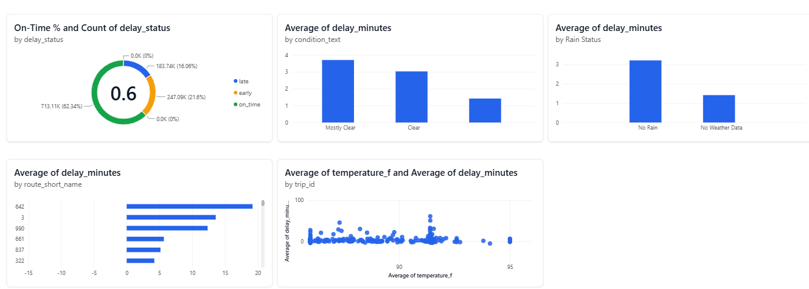

# Findings

This page covers what the dashboard shows so far, and is explicit about
what it doesn't show yet. The project's original question was simple: does
weather actually make CapMetro buses run late, and by how much? The honest
answer right now is that the pipeline can measure delay reliably, but
hasn't yet collected enough weather variance to answer the weather part
with any confidence.

## What the data shows

Based on the current rolling window of live-polled trip data:

- **64.5%** of trips run on-time
- **20.8%** run early
- **14.7%** run late

This comes from a continuously polling pipeline (Airflow ingesting live
GTFS-Realtime data every minute), not a static snapshot, so it reflects
actual recent performance rather than a one-time pull.

The route-level breakdown shows real variation in average delay across
routes, which is the more immediately actionable part of this data: a
transit agency (or a rider) can act on "route 642 runs consistently later
than route 333" today, without needing the weather question answered at
all.

## What the data doesn't show yet, and why

The weather correlation charts are built and functional, but not yet
meaningful:

- The **delay by weather condition** chart currently shows only one
  condition ("Clear"), because the data window has too little day-to-day
  weather variety to compare against.
- The **rain vs. no-rain** comparison is showing a "No Weather Data"
  category alongside "No Rain," meaning a portion of trips in the window
  aren't matched to any weather observation at all yet.
- The **temperature scatter** shows delay clustered in a narrow
  temperature band, because the underlying date range is narrow.

The root cause is operational, not analytical: this pipeline depends on a
local Airflow process staying continuously alive, and it's been
interrupted more than once when the terminal running it got closed. Each
interruption resets how much usable history is in the rolling window. This
is a real, documented limitation of running orchestration locally rather
than on a persistent service, and it's part of what the project's
postmortem will cover.

## What would make the weather findings trustworthy

- Multiple consecutive days of uninterrupted polling, to build up real
  day-to-day weather variance
- At least one day with actual measurable rainfall, since the current
  window has had none
- A wider temperature range than a single narrow band, to see whether
  delay actually tracks temperature or just looks flat because the range
  is too small to tell

Until those conditions are met, any claim of "weather affects delay" or
"weather doesn't affect delay" from this dashboard would be reading noise
as signal. The charts are left in place because they're correct and ready,
not because they currently prove anything.
